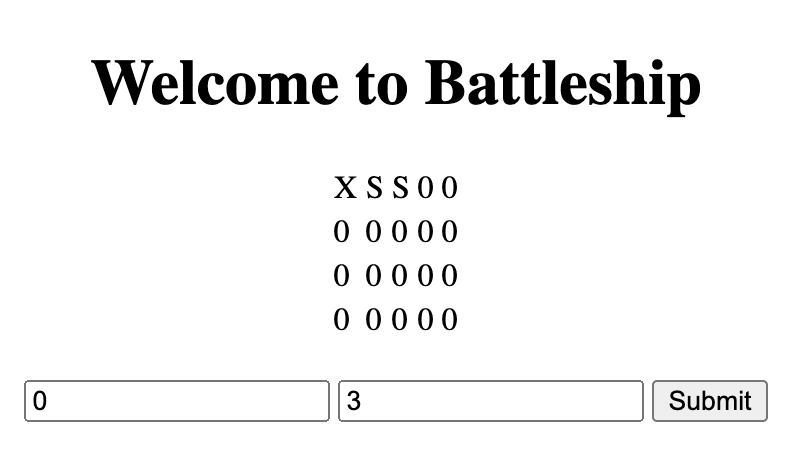
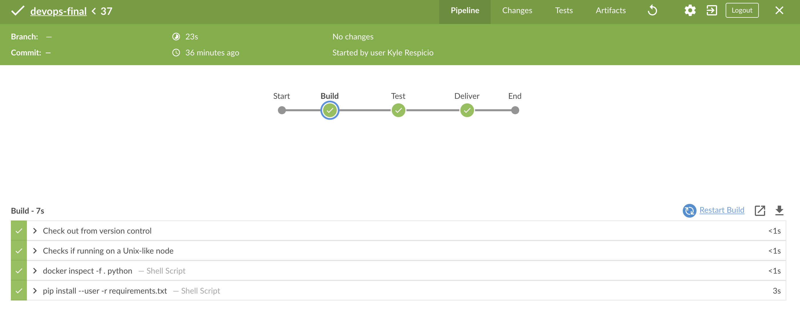
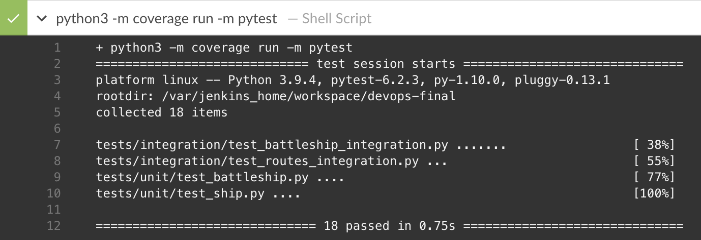
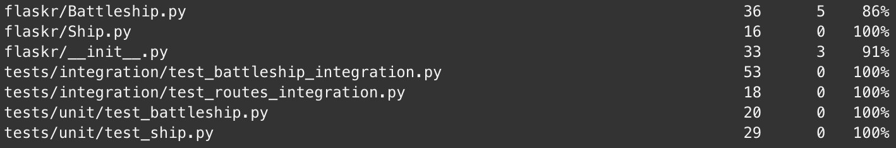

# Devops-Final

## Application Details

* Play battleship against yourself
* Created with:
  * Python Flask
  * HTML

## Pipeline Details
* Created with:
  * Docker
  * Jenkins
* Over 90% Code Coverage
* Unit tests for Ship and Battleship classes
* Integration tests for Ship, Battleship, and Routes
* Jenkins Guide for activing Jenkins
  * [Jenkins](https://www.jenkins.io/doc/tutorials/build-a-python-app-with-pyinstaller/)

